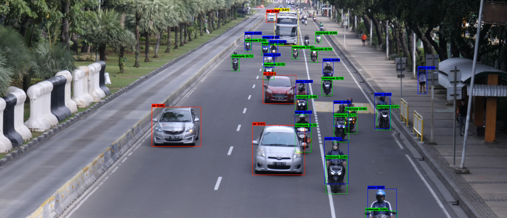

# Object Detection and Visualization in Traffic Video using RFDETR

This project utilizes the RFDETR (Region-Free Detection Transformer) model to detect and visualize objects in a traffic video. It focuses on identifying **cars**, **motorcycles**, and **people** using bounding boxes and confidence scores, then writes the annotated video to an output file.

## 🎯 Features

- Detects objects: `car`, `motorcycle`, `person` and ....
- Annotates frames with bounding boxes and class labels
- Uses color-coded boxes for easy visual distinction:
  - 🔴 Red → Car
  - 🟢 Green → Motorcycle
  - 🔵 Blue → Person
- Displays annotated preview frames every 30 frames in Google Colab
- Saves the output video as `output.mp4`

---

## 📦 Requirements

Install the following Python packages:

```bash
pip install opencv-python numpy rfdetr
```

Ensure the following files are in the same directory:

- `rfdetr.py` → Contains the `RFDETRBase` model class
- `class_id.json` → JSON file mapping class IDs to human-readable labels
- `vecteezy_traffic.mov` → Input traffic video file

---

## 🚀 Usage

Run the main detection script:

```bash
python main.py
```

The script will:
1. Load the RFDETR model
2. Open the video file and read frame-by-frame
3. Detect and annotate objects
4. Show preview frames (every 30th frame) in Colab
5. Save the annotated video as `output.mp4`

---

## ⚙️ Working Principle

### 🔹 1. Model Initialization
- Initializes the `RFDETRBase` model.
- Loads the class ID-to-name mapping from `class_id.json`.

### 🔹 2. Video Processing
- Opens and reads frames from the input video file.
- Detects objects with `model.predict(frame, threshold=0.5)`.

### 🔹 3. Drawing Detections
- Draws bounding boxes with OpenCV.
- Class names and confidence scores are displayed.
- Color-coded boxes help differentiate object classes.

### 🔹 4. Output
- Saves processed video as `output.mp4`.
- Displays preview every 30 frames using `cv2_imshow()`.

---

## 🧠 Model Details

The `RFDETRBase` class (inside `rfdetr.py`) is a custom Transformer-based object detection model. Its `predict()` method returns:

- `xyxy`: list of bounding box coordinates (x1, y1, x2, y2)
- `class_id`: predicted class IDs
- `confidence`: confidence scores of predictions

---

## 💾 Output

After processing, you will see:

- A new video file: `output.mp4`  
- Every 30th frame displayed inline (for Google Colab users)

### 📸 Example Frame Preview

> *(Optional)* Add a preview image here if desired:

```markdown

```

---

## 🗂 Project Structure

```
📁 Your Project Folder/
├── main.py                       # Main script
├── rfdetr.py                     # RFDETRBase model implementation
├── class_id.json                 # Class label mappings
├── vecteezy_traffic.mov          # Input video file
├── outputhd102.mp4               # Annotated output video
└── README.md                     # Project documentation (this file)
```

---

## 🔮 Future Improvements

- ✅ Add object tracking (e.g., Deep SORT)
- ✅ Support real-time webcam input
- ✅ Expand detection to more object classes
- ✅ GPU acceleration for faster processing
- ✅ Export object data (CSV/JSON) for analysis

---

## 👨‍💻 Author

**Ahmet Yasir Duman**  
GitHub: [@ahmetduman23](https://github.com/ahmetduman23?tab=repositories)  
LinkedIn: [Ahmet Yasir Duman](https://www.linkedin.com/in/ahmet-yasir-duman-03b689256)

---

## 💬 Feedback

This project is designed to support traffic surveillance, safety systems, and computer vision learning.  
Feel free to suggest ideas, ask questions, or contribute improvements! 🚀
```
